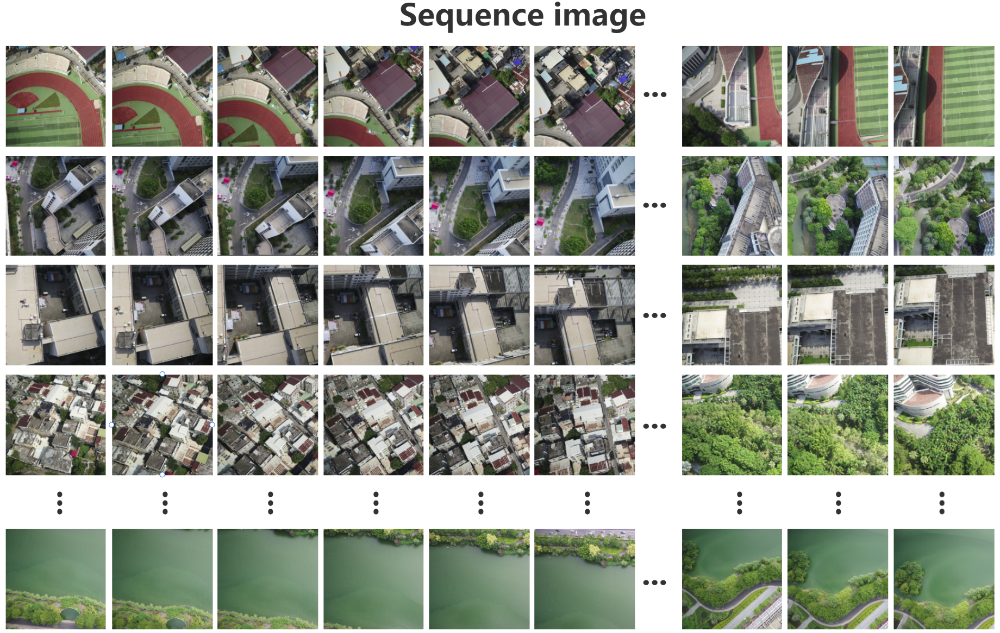

# Joint Semantic Enhancement with Spatiotemporal Motion Guidance for UAV Precise Self-Localization
This repository contains dataset for the paper titled Joint Semantic Enhancement with Spatiotemporal Motion Guidance for UAV Precise Self-Localization. 

The dataset can be downloaded [here](http://39.98.109.195:1000/share/j-_ceMDF). The password：5XUCujMlDA7m

## About Dataset

The dataset split is as follows:
| Subset | Drone-Imgs | Satellite-Imgs | Sequence |
| :---: | :---: | :---: | :---: |
| Train | 13569 | 1 | 24 |
| Test | 2036 | 1 | 24 |

More detailed file structure:
```
├── HQU-UAV/
│   ├──train/
│       ├──0/
│           ├──0.xlsx    /* drone images annotation file
│           ├──0_0001. jpg    /* drone image
│           ├──0_0002. jpg
│           ├──0_0003. jpg
|           ...
│       ├──1/
│           ├──1.xlsx
│           ├──1_0001. jpg
│           ├──1_0002. jpg
|           ...
│   ├──test/
│       ├──0/
│           ├──0.xlsx
│           ├──0_0001. jpg
│           ├──0_0002. jpg
│           ├──0_0003. jpg
|           ...
│       ├──1/
│           ├──1.xlsx
│           ├──1_0001. jpg
│           ├──1_0002. jpg
|           ...
│   ├──satellite/
│       ├──coordinates. csv    /* satellite images annotation file
│       ├──0000. png    /* satellite image
│       ├──0001. png
│       ├──0002. png
|           ...
│   ├──HQU. tif    /* satellite map
│   ├──HQU. tifw    /* world file for tif
│   ├──match. xlsx
```
For more detailed information, please refer to the documentation provided within the dataset.
